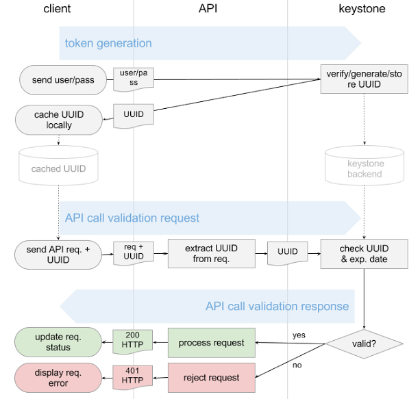
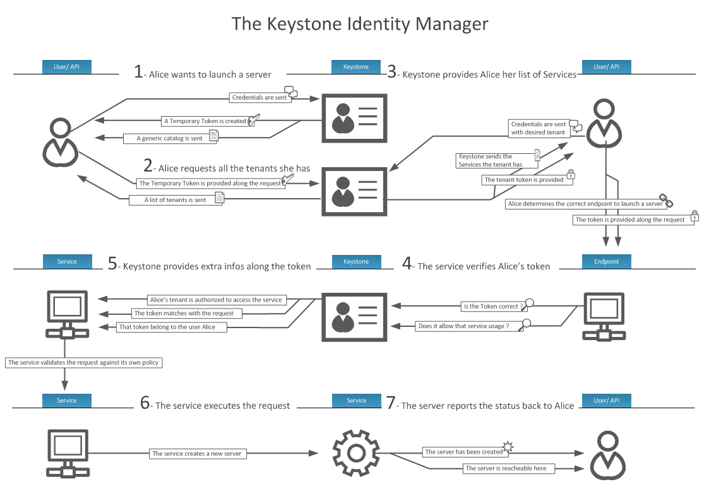

#KeyStone Project#
>
## 1. Introduction to Open Stack  ##
>
> A free and open-source platform for cloud computing deployed on IaaS. Internet as a Service provides infrastructure for the cloud-service model. OpenStack consists of various components like hardware, Storage, Network Resources which are interrelated with each other.
> 
> IaaS, abstracts its features from users by just allowing the access to requested resources. Data partitioning, Scaling, Security, storage (backup), physical location, Physical Computing Resources are all abstracted. Some of the resources provided by IaaS would be 
> 
- Virtual Machine Disk Image library
- Raw block storage
- File/Object storage
- Firewalls
- Load Balancers
- IP address
- VLAN services

> IaaS providers manages multiple VM’s and these guest VM’s spin up/down based on the requirements requested by User. Users will install Operating System image for boot up the VM and all the related patches and maintenance of OS are done by users. All the services provided by Cloud are managed by user either through Web-based dashboard (CLI) or through RESTful-API.

> Services provided by Open stack are categorized as below for various purposes:
> 
- Keystone (as Identity Service)
- NOVA (as Compute)
- Glance (as Image Service)
- Neutron (networking)
- Horizon (Dashboard)
- Cinder (Block Storage)
- Heat (orchestration) and many other

> This report would deal with Keystone (identity Service).

## 2. Keystone

> Keystone provides identity, token, catalog and policy services to be used by various projects in OpenStack. It is a common authentication system for the cloud service which integrates with backend services (example: LDAP). Authentication and Authorization are handled by it. Authentication is handled in different ways.

## 2.1 Keystone’s Components
>
- **User:**
> 
> Users are digital representations of a person, system, or service that uses OpenStack cloud services. Keystone ensures that incoming requests are coming from a valid login user that can be assigned resource-access tokens. Users are assigned to a particular tenant with specific role.

> 

>- **Tenant**
>
>A tenant is a group used to isolate resources and/or users. Groups can be mapped to customers, projects or organizations.

>-  **Role**
>
>A role includes a set of assigned user rights and privileges for performing a specific set of operations. A user token issued by Keystone includes a list of that user’s roles. Services then determine how to interpret those roles.

>- **Credentials**

> Credentials are data known only by a specific user who proves his or her identity. Examples include username and password, username and API key, or an authentication token.

>- **Authentication**

>Authentication is the act of confirming a user’s identity by validating a set of user-supplied credentials. Those credentials are initially a username and password or a username and API key. In response to the credentials, the identity service issues an authentication token that the user must provides for subsequent requests.

>- **Token**

>A token is an arbitrary bit of text used to access resources. Each token has a scope describing accessible resources. A token may be revoked at any time and is valid for a finite duration.

>- **Service**

>An OpenStack service, such as Compute (Nova), Object Storage (Swift), or Image Service (Glance), provides one or more endpoints through which users can access resources and perform operations.

>- **Endpoint**

>An endpoint is a network-accessible address, usually described by URL, from which services are accessed.

>## 3. KeyStone Authentication

> There are ***two ways of authentication*** for keystone due to the way how client provides their identification: ***UUID and PKI***.

>## 3.1 Universally Unique IDentifier (UUID) ##
>
- Username and password are used as standard credential service.
- These credentials are authenticated by identity service by generating a Token.
- This token is sent back to client and a UUID generation takes place.
- This token is used to establish a session with the OpenStack services and going further a user can directly use this token to login the system instead of making use his credentials.
- Using this saved token, user can also access his previous environment status.

>**Keystone Authentication Process State Diagram:**


>UUID is quite simple to implement but since every requirement will be via keystone and it could be the bottleneck in the large scale cloud.


> ## 3.2 PKI Token ##
> 
> The workflow is similar but the token is based on X509 PKI while Keystone is the CA.

>
- When keystone was installed , we need to generate the keys and certs including CA private key, CA certificates, Signing private key, Signing certificate.
- When client provides valid username/password pair, Keystone will use Cryptographic Message Syntax (CMS) to produce CMS token out of the following data: Service catalog,User roles,Metadata
2. The token will be cached in keystone and send back to client.
3. When the requests come via API, they will attach the CMS token , the API has got keystone’s copy of Signing certificate, Revocation list, CA certificate so it can check the validity of token offline (without contacting keystone)
4. If valid, keystone will return the 200 and process the request, otherwise will be an 401 then reject.

># 3.2.1 Keystone Authentication Process - PKI-token-validation-flow #


> # 4. Responsibilities involved by Keystone development #

>The responsibilities involved by keystone development include: 
>
- Creating OpenStack identity services
- Provides WSGI middleware
- Python Client Library.

> Key stone Functionality (Configuring other services to work with Keystone)
A rough & basic functionality of Keystone and its authentication service is displayed below with keystone middleware architecture. 

> 1. Client makes a call requesting access to the services which will generate a token. The keystone middleware will check for authentication by validating this token.If (Authentication Success) Successfully bypass the middleware Else Throwback error to User.

> 2. Further, this token is used to bypass the middleware which brings access to various OpenStack projects which your token is assigned to. Here the data is passed to various OpenStack services in Header format generated by middleware. Data here will include (Username, userid, Project Name, Project Id, Roles etc).


>**Keystone Middleware (Authentication Middleware):**
> This acts as internal API for OpenStack project based on WSGI standard. Since the middleware deals with authentication protocols, some of the possible Authentication protocols here would be:
> 
- Http basic Authentication
- Digest Access
- Public Key
- Token (Used by OpenStack as Authentication component to show Authentication & Authorization for service).


>##5.  Keystone Architecture


## 6. Keystone Services and their interaction
>Keystone service architecture defines various services for various purposes.

>- **Identity Service:**
This service is responsible for Authentication of user credentials and also it holds data about users and their associated groups. This is considered to be base case.
Same service when performed from Authoritative backend, then it would be managed by LDAP.

>- **Resource Service:**
Data about projects & domains are provided by this service. This data is managed by this service (or) it can be pulled from another authoritative backend service like LDAP. Whenever the Resource service doesn’t have information of any requested Project/Domain then LDAP would be pointed out to fetch the required data (or) in any problem of such data, Resource service will populate the data from LDAP.

>- **Assignment Service:**
Identity and Resource service will manage various entities. Roles and their assignments related to these entities are provided by Assignment Service. This service also uses LDAP service in absence of such data.

>- **Catalog Service:**
In general, a catalog is generated when a temporary token is created for user. It provides an endpoint registry used for end-point discovery.

>- **Policy Service:**
A rule-based authorization engine and associated Rule management interface is provided by Policy service.

>## 7. Keystone Identity Manager 

>

> **Application Construction:**
> 
Keystone acts as HTTP front-end to OpenStack services. Web-based services are used by users to access the cloud services. Keystone is developed by python WSGI interfaces through which it is communicated and is configured with other services using Python Paste. Each of the application HTTP endpoints are made up of WSGI middleware.

>All these front-end HTTP endpoints are linked to controllers using keystone.common.wsgi.ComposingRouter. Each Controller has at-least one ***Manager*** loaded (which are like wrapper classes) that contain ***appropriate service driver*** based on keystone configuration.

> **Service Backend:**
 
>Each keystone service (like identity, Assignment etc.)  can be configured to use various backend services to allow keystone to fit to various environments. Keystone.config file maintains all the information regarding these services. Every service will be having a key driver associated. Further, the backend services can be any environments related to Networks, Storage, and Imaging etc.

>Backend Driver associated with each keystone service will provide implementations of how to deal with various environments in the back end.Some possible backend service would be SQL backend,
Template backend, LDAP (Authoritative backend)


>**Authentication Policy:**
>
1. Checks whether performing user is an Admin.
2. Check whether performing user matches the user being referenced (Validation process).

> ## 8. Creating “User – Profile – Role” in Keystone:
>
“**keystone-manage bootstrap**”: 
>
>This command is used to create a User, Project, Role in keystone where a “Role is assigned to User on some Project.”  Default Name provided for such creation would be admin.

>Defaults thus provided can be changed using the bootstrap commands (or) environmental equivalent names given to them
>
> --bootstrap-username		or	OS_BOOTSTRAP_USERNAME
>
>--bootstrap-project-name	or	OS_BOOTSTRAP_PROJECT_NAME
>
>--bootstrap-role-name		or	OS_BOOTSTRAP_ROLE_NAME
>
>--bootstrap-password		or	OS_BOOTSTRAP_PASSWORD
>
**Creating Identity Service:**
>
--bootstrap-public-url
>
>--bootstrap-admin-url
>
>--bootstrap-internal-url

>## 8.1 Command Line Interface 
>The below are the list of command line commands that can be used.`*The keystone CLI is deprecated in favor of python-openstackclient.' *

>
    catalog                       List service catalog, possibly filtered by service.
    ec2-credentials-create        Create EC2-compatible credentials for user per tenant.
    ec2-credentials-delete        Delete EC2-compatible credentials.
    ec2-credentials-get           Display EC2-compatible credentials.
    ec2-credentials-list          L ist EC2-compatible credentials for a user.
    endpoint-create         	  Create a new endpoint associated with a service.
    endpoint-delete               Delete a service endpoint.
    endpoint-get                  Find endpoint filtered by a specific attribute or service type.
    endpoint-list                 List configured service endpoints.
    password-update               Update own password.
    role-create                   Create new role.
    role-delete                   Delete role.
    role-get                      Display role details.
    role-list                     List all roles.
    service-create                Add service to Service Catalog.
    service-delete                Delete service from Service Catalog.
    service-get                   Display service from Service Catalog.
    service-list                  List all services in Service Catalog.
    tenant-create                 Create new tenant.
    tenant-delete                 Delete tenant.
    tenant-get                    Display tenant details.
    tenant-list                   List all tenants.
    tenant-update                 Update tenant name, description, enabled status.
    token-get                     Display the current user token.
    user-create                   Create new user.
    user-delete                   Delete user.
    user-get                      Display user details.
    user-list                     List users.
    user-password-update          Update user password.
    user-role-add                 Add role to user.
    user-role-list                List roles granted to a user.
    user-role-remove              Remove role from user.
    user-update                   Update user's name, email, and enabled status.
    discover                      Discover Keystone servers, supported API versions and extensions.
    bootstrap                     Grants a new role to a new user on a new tenant, after creating each.
    bash-completion               Prints all of the commands and options to stdout.
    help                          Display help about this program or one of its subcommands.

>## 9. KeyStone Installation ##
>In this, we would explain the keystone service installation using two methods:
>
1. Installing KeyStone
2. Devstack which has KeyStone service installed

> ## 9.1 Install Keystone - OpenStack Identity Service ##
>
sudo apt-get install -y keystone apache2 libapache2-mod-wsgi memcached python-memcache python-keystoneclient

>***Create Keystone database***
>
mysql -u root -pnotmysql -e "CREATE DATABASE keystone;"
mysql -u root -pnotmysql -e "GRANT ALL ON keystone.* TO 'keystone'@'localhost' IDENTIFIED BY 'notkeystone';"
mysql -u root -pnotmysql -e "GRANT ALL ON keystone.* TO 'keystone'@'%' IDENTIFIED BY 'notkeystone';"

>***Configure Keystone***
>
sudo sed -i "s|connection = sqlite:////var/lib/keystone/keystone.db|connection=mysql+pymysql://keystone:notkeystone@$MY_PRIVATE_IP/keystone|g" /etc/keystone/keystone.conf
>
>sudo sed -i "s|#servers = localhost:11211|servers = localhost:11211|g" /etc/keystone/keystone.conf
>
sudo sed -i "s|# memcache_pool, and sql. (string value)|driver = memcache|g" /etc/keystone/keystone.conf

>***Initialize Keystone database***
>
sudo keystone-manage db_sync

>***Configure ServerName Option in apache config file***
>
( cat | sudo tee -a /etc/apache2/apache2.conf ) <<EOF
ServerName $MY_IP
EOF

>***Create and configure Keystone virtual hosts file***
>***Disable the default virtual host**:*
>
sudo rm /etc/apache2/sites-enabled/000-default.conf

>***Enable the Keystone virtual host***
>
sudo a2ensite wsgi-keystone

>***Restart the Apache HTTP server***
sudo service apache2 restart

>***Export Keystone "service" credentials to populate service catalog and create first user / tenant***
>
export OS_TOKEN=ADMIN
export OS_URL=http://$MY_PRIVATE_IP:35357/v2.0

>***Populate service in service catalog***
>
openstack service create --name keystone --description "OpenStack Identity" identity

>***List services***
>
openstack service list

>***Populate identity endpoints in service catalog***
>
openstack endpoint create --region RegionOne identity --publicurl http://$MY_PUBLIC_IP:5000/v2.0 --internalurl http://$MY_IP:5000/v2.0 --adminurl http://$MY_IP:35357/v2.0

>***Create the MyProject project***
>
openstack project create --description "MyProject" MyProject

>***Create the Service project***
>
openstack project create --description "Service Project" Service

>***Create the user***
>
openstack user create --password mypassword <username>

>**Create role**
>
openstack role create <role name>

>***Add role to the project and user***
>
openstack role add --project <Project name> --user <user> <role>

>***Unset the temporary OS_TOKEN and OS_URL environment variables***
>
>unset OS_TOKEN
>unset OS_URL

>***Using the openstack cli and as <user name>, request an authentication token***
>
openstack --os-auth-url http://$MY_IP:5000/v2.0 --os-project-name myproject --os-username <user> --os-password mypassword token issue

>***Create <user> credentials***
>
mkdir ~/credentials
>
cat >> ~/credentials/<user> <<EOF
>
export OS_REGION_NAME=RegionOne
>
export OS_PROJECT_NAME=myproject  # Required for python-openstackclient
>
export OS_TENANT_NAME=myproject  # Required for python-keystoneclient (deprecated)
>
export OS_USERNAME=<username>
>
export OS_PASSWORD=<username password>
>
export OS_AUTH_URL=http://$MY_IP:35357/v2.0
>
EOF

>***Source the <user> credentials***
>
source ~/credentials/<user>	

>***Using python-openstackclient, get a token***
>
openstack token issue

>***Use your token to list domains via the v3 API***
>
curl -H "X-Auth-Token:YOUR_SCOPED_TOKEN" http://localhost:5000/v3/domains | python -m json.tool

># 9.2 Install DevStack #
>The following steps should be followed on ubuntu 14.04 for installation of KeyStone servic.
>
>**Clone DevStack**
git clone https://git.openstack.org/openstack-dev/devstack

>**Create local.conf file**
>
cd devstack
<vi,nano,etc> local.conf

>Copy the following:
>
[[local|localrc]]
>
ADMIN_PASSWORD=secrete
>
>DATABASE_PASSWORD=$ADMIN_PASSWORD
>
>RABBIT_PASSWORD=$ADMIN_PASSWORD
>
>
>SERVICE_PASSWORD=$ADMIN_PASSWORD
>
>SERVICE_TOKEN=a682f596-76f3-11e3-b3b2-e716f9080d50
>
>GIT_BASE=https://git.openstack.org
>
>disable_service n-net
>
>enable_service q-svc
>
>enable_service q-agt
>
>enable_service q-dhcp

>**Install DevStack**
>
./stack.sh

>
>Go to directory - /opt/stack, You will find a folder keystone in it.


# 11. Introduction to REST API #
>
>REST stands for Representational State Transfer. It is an architectural pattern for developing web services. REST web services communicate over the HTTP specification, using HTTP vocabulary:
>
- Methods (GET, POST, etc.)
- HTTP URI syntax (paths, parameters, etc.)
- Media types (xml, json, html, plain text, etc)
- HTTP Response codes.

# 11.1 Example of REST API to get Unscoped Token #

In this section, we would explain how a token is generated when we send a POST request to http://localhost:5000/v3/auth/tokens. We receive an un scoped token as shown below:


The header is also included in the request which here is sepcifying that the content type being sent is in json format.

Once the request is sent, we receive the token along with other details.


# 12. Solving keystone bugs 

#### 12.1 Bug Description : 
This bug is meant as a quick fix to get endpoint filtering to work and be consistent with the normal v3 catalog.
The current EndpointFilterCatalog are missing the following to be consistent with the normal v3 catalog :
- EndpointFilterCatalog only returns 'region_id'. The normal v3 catalog also includes 'region' for backwards compatibility. The vast amount of tools still use 'region' and will fail unless it's present.
- EndpointFilterCatalog doesn't include the endpoint's name.

EndpointFilterCatalog currently returns the following :
```~
'endpoints': [{
  'url':'https://objects.zetta.io:8443/v1/AUTH_d67f3235ece449ecaf8a9f731ca9a10c',
  'interface': 'public',
  'region_id': 'no-osl1',
  'id': u'6513c4a646594292a3f8cdf65a0882f3'
 }],
 'type': 'object-store',
 'id': '7a806e12a8644d7ea67e6e4f4c287fec'
},
```

Normal v3 catalog returns the following:
```~
'endpoints': [{
  'url': 'https://objects.zetta.io:8443/v1/AUTH_d67f3235ece449ecaf8a9f731ca9a10c',
  'interface': 'public',
  'region_id': 'no-osl1',
  'region': 'no-osl1',
  'id': u'6513c4a646594292a3f8cdf65a0882f3'
 }],
 'type': 'object-store',
 'name': 'swift',
 'id': '7a806e12a8644d7ea67e6e4f4c287fec'
},
```

similar bug : 
https://bugs.launchpad.net/keystone/+bug/1410543

### 12.2 How is this affecting the service 
The keystone service catalog was not populated as expected. The region name was not fetched .

### 12.3 How to reproduce this bug ? 

OpenStack Identity API enables creation of ad-hoc catalogs for each project-scoped token request. To do so, this API uses either static project-endpoint associations or dynamic custom endpoints groups to associate service endpoints with projects.

#### 12.4 Endpoint Group: 

Represents a dynamic collection of service endpoints having the same characteristics, such as service_id, interface, or region. Indeed, any endpoint attribute could be used as part of a filter.

>A classic use case is to filter endpoints based on region. For example, suppose a user wants to filter service endpoints returned in the service catalog by region, the following endpoint group may be used

```1
{
    "endpoint_group": {
        "description": "Example Endpoint Group",
        "filters": {
            "region_id": "e68c72"
        },
        "name": "EP-GROUP-1"
    }
}
```

This implies an Endpoint Group with filtering criteria of the form:
```~
region_id = "e68c72"
```


If a valid X-Auth-Token token in not present in the HTTP header and/or the user does not have the right authorization an HTTP 401 Unauthorized is returned.

> To Have this endpoints working we need to have the normal v3 catalog to be consistent with EndpointFilterCatalog and should be strictly associated to each other.

### 12.5 To check Association: 
```~
GET /OS-EP-FILTER/projects/{project_id}/endpoints
```

We normaly configure the group in keystone.conf

### 12.6 How did they solve the bug

This is a easy fix .
change the code as follows :
 ```~
 del endpoint['legacy_endpoint_id']
            # Include deprecated region for backwards compatibility
            endpoint['region'] = endpoint['region_id']
            endpoint['url'] = catalog_core.format_url(
                endpoint['url'], substitutions)
            # populate filtered endpoints
            if 'endpoints' in services[service_id]:
                service['endpoints'].append(endpoint)
            else:
                service['endpoints'] = [endpoint]

        # format catalog
        catalog = []
        for service_id, service in services.items():
            formatted_service = {}
            formatted_service['id'] = service['id']
            formatted_service['type'] = service['type']
            formatted_service['name'] = service['name']
            formatted_service['endpoints'] = service['endpoints']
 ```
in keystone/contrib/endpoint_filter/backends/catalog_sql.py file 

to test the functionality, edit the following file :

```~
   # Ensure name of the service exists
        self.assertIn('name', r.result['token']['catalog'][0])

        # region and region_id should be the same in endpoints
        endpoint = r.result['token']['catalog'][0]['endpoints'][0]
        self.assertIn('region', endpoint)
        self.assertIn('region_id', endpoint)
        self.assertEqual(endpoint['region'], endpoint['region_id'])
```


