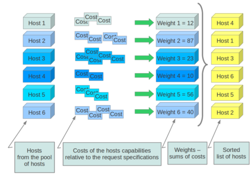
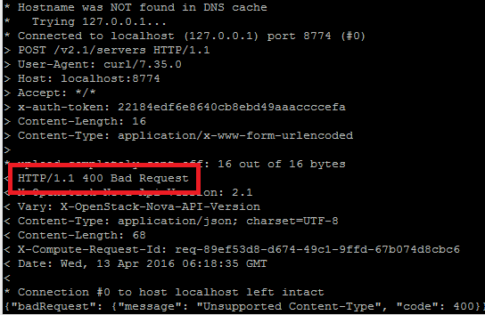

**Abstract-**  This project addresses our need to learn about the Nova service in OpenStack in order to make code contributions.  The first four sections of this project demonstrate our understanding of how Nova operates and communicates with the other services within OpenStack on a conceptional level.  The last two sections demonstrate our understanding of how Nova has been implemented in code.  This abstract will be updated once we have made a decision as to how to modify the functionality of Nova to suit our needs.

## Outline ##
- 1) Introduction
- 2) Architecture
	- 2.1) Nova REST API
	- 2.2) Messaging
	- 2.2.1) Oslo/Messaging
	- 2.3) Filter Scheduler
	- 2.4) Threading Model
	- 2.5) Block Device Mapping
	- 2.6) Compute
	- 2.7) Conductor
	- 2.8) SQL Database
	- 2.9) Host Aggregates
	- 2.10) Notifications
	- 2.11) Virtual Machine States and Transitions
	- 2.12) Internalization
    - 2.13) Interactions with other OpenStack Services
		- 2.13.1) Glance
		- 2.13.2) Neutron
		- 2.13.3) Keystone
	- 2.14) Nova-network
- 3) Installation
	- 3.1) Installing Nova from DevStack Source
	- 3.2) Installing Nova from Packages 
- 4) CLI
  - 4.1) Managing Nova
  - 4.2) Managing Instances
  - 4.3) Accessing Instances
- 5) Definitions
- 6) Code Review
	- 6.1) Nova Code Directory Structure
	- 6.2) Bugs
		- 6.2.1) DELETE /servers returns 404 when it should return 405
		- 6.2.2) nova dashboard displays wrong quotas
		- 6.2.3) Language enhancements in the description of [oslo_messaging_rabbit]
		- 6.2.4) no warning message for empty username with inline user edit
		- 6.2.5) Removed "Disable user" from dropdown menu for self (Horizon)
- 7) Code Contribution
- 8) References

## 1. Introduction ##

Nova is all about access to compute resources.  

Nova is used for hosting and managing cloud computing systems.  It is a component based architecture enabling quicker additions of new features.  It is scalable, on-demand, fault tolerant, recoverable and provides API-compatibility with systems like Amazon EC2.  Nova provides compute resources such as virtual machines, containers, and bare metal servers.

Nova is built on a messaging architecture.  All of its components can typically be run on several servers.  This architecture allows the components to communicate through a message queue. Deferred objects are used to avoid blocking while a component waits in the message queue for a response.

As the most distributed component in the OpenStack platform, Nova interacts heavily with other OpenStack services like Keystone for performing authentication, Horizon for its Web interface and Glance for supplying its images.

## 2. Architecture ##

###2.1 Nova REST API###

This is the Nova component that receives HTTP requests, converts commands and communicates with other components via the oslo.messaging queue or HTTP.

**List API versions**

Lists information about all Compute API versions.

- Lists information for all API versions. (GET)

**Servers (servers)**

Lists, creates, shows details for, updates, and deletes servers. (For the OpenStack Compute API, a server is a virtual machine (VM) instance, a physical machine or a container.) 

- List servers (GET)
- Create server (POST)
- List details for servers (GET)
- Show server details (GET)
- Update server (PUT)
- Delete server (DELETE)

**Servers multiple create (servers)**

Creates one or more servers.

- Create multiple servers (POST)
- Create multiple servers with reservation ID (POST)

**Servers - run an action (servers, action)**

- Enables all users to performs an action on a server. 
- Add (associate) fixed IP (addFixedIp action) (POST)
- Add (associate) floating IP (addFloatingIp action) (POST)
- Change administrative password (changePassword action) (POST)
- Confirm resized server (confirmResize action) (POST)
- Create image (createImage action) (POST)
- Evacuate server (evacuate action) (POST)
- Force-delete server (forceDelete action) (POST)
- Lock server (lock action) (POST)
- Pause server (pause action) (POST)
- Show console output (os-getConsoleOutput action) (POST)
- Get RDP console (os-getRDPConsole action) (POST)
- Get serial console (os-getSerialConsole action) (POST)
- Get SPICE console (os-getSPICEConsole action) (POST)
- Get VNC console (os-getVNCConsole action) (POST)
- Reboot server (reboot action) (POST)
- Rebuild server (rebuild action) (POST)
- Remove (disassociate) fixed IP (removeFixedIp action) (POST)
- Remove (disassociate) floating IP (removeFloatingIp action) (POST)
- Rescue server (rescue action) (POST)
- Resize server (resize action) (POST)
- Restore soft-deleted instance (restore action) (POST)
- Resume suspended server (resume action) (POST)
- Revert resized server (revertResize action) (POST)
- Shelve server (shelve action) (POST)
- Shelf-offload (remove) server (shelveOffload action) (POST)
- Start server (os-start action) (POST)
- Stop server (os-stop action) (POST)
- Unlock server (unlock action) (POST)
- Unpause server (unpause action) (POST)
- Unrescue server (unrescue action) (POST)
- Unshelve (restore) shelved server (unshelve action) (POST)
- Add security group to a server (addSecurityGroup action) (POST)
- Remove security group from a server (removeSecurityGroup action) (POST)
- Servers - run an administrative action (servers, action) (POST)
- Create server back up (createBackup action) (POST)
- Inject network information (injectNetworkInfo action) (POST)
- Migrate server (migrate action) (POST)
- Live-migrate server (os-migrateLive action) (POST)
- Reset networking on a server (resetNetwork action) (POST)
- Reset server state (os-resetState action) (POST)

**Servers - run an administrative action (servers, action)**

- Create server back up (createBackup action) (POST)
- Inject network information (injectNetworkInfo action) (POST)
- Migrate server (migrate action) (POST)
- Live-migrate server (os-migrateLive action) (POST)
- Reset networking on a server (resetNetwork action) (POST)
- Reset server state (os-resetState action) (POST)

**Servers diagnostics (servers, diagnostics)**

Shows the usage data for a server.

- Show server diagnostics (GET)

**Servers IPs (servers, ips)**

Lists the IP addresses for an instance and shows details for an IP address.

- List IPs (GET)
- Show IP details (GET)

**Server metadata (servers, metadata)**

Lists metadata, creates or replaces one or more metadata items, and updates one or more metadata items for a server. Also shows details for, creates or replaces, and updates a metadata item, by key, for a server.

- List all metadata (GET)
- Create or replace metadata items (PUT)
- Update metadata items (POST)
- Show metadata item details (GET)
- Create or update metadata item (PUT)
- Delete metadata item (DELETE)

**Servers - list actions (servers, os-instance-actions)**

All users can list available actions for a server and they can show details for a server action; however, only administrators can view server events in server action details.

- List actions for server (GET)
- Show server action details (GET)

**Port interfaces (servers, os-interface)**

Creates a port interface and uses it to attach a port to a server and detaches a port interface from a server. Also, lists all port interfaces and shows details for a port interface.

- Create interface (POST)
- List port interfaces (GET)
- Show port interface details (GET)
- Detach interface (DELETE)

**Servers virtual interfaces (servers, os-virtual-interfaces)**

Lists virtual interfaces for a server instance.

- List virtual interfaces (GET) 

**Servers with volume attachments (servers, os-volume_attachments)**

Attaches volumes that are created through the volume API to server instances. Also, lists volume attachments for a server instance, shows details for a volume attachment, and detaches a volume.

- Attach volume to server (POST)
- List volume attachments (GET)
- Show volume attachment details (GET)
- Detach volume (DELETE)

**Flavors with extended attributes (flavors)**

Shows information about flavors.

- List flavors(GET)
- Create flavor (POST)
- Show flavor details (GET)
- Delete flavor (DELETE)
- List flavors with details (GET)

**Flavors access (flavors, os-flavor-access, action)**

Lists tenants who have access to a private flavor and adds private flavor access to and removes private flavor access from tenants. By default, only administrators can manage private flavor access. 

- List flavor access information for given flavor (GET)
- Add flavor access to tenant (POST)
- Remove flavor access from tenant (POST)

**Flavors extra-specs (flavors, os-flavor-extra-specs)**

Lists, creates, deletes, and updates the extra-specs or keys for a flavor.

- Create extra specs for a flavor (POST)
- List extra specs for a flavor (GET)
- Show an extra spec for a flavor (GET)
- Update an extra spec for a flavor (PUT)
- Delete an extra spec for a flavor (DELETE)

**Keypairs (keypairs)**

Generates, imports, and deletes SSH keys.

- List keypairs (GET)
- Create or import keypair (POST)
- Delete keypair (DELETE)
- Show keypair details (GET) 

**Limits (limits)**

Shows rate and absolute limits for the tenant.

- Show rate and absolute limits (GET) 

**Extensions (extensions)**

Lists available extensions and shows information for an extension, by alias.
( Extensions are deprecated in Compute API v2.1. , and supported in v2.0.  )

- List extensions (GET)
- Show extension details (GET)

**Images**

Lists, shows details for, and deletes images. Also sets, lists, shows details for, and deletes image metadata.

- List images (GET)
- List images details (GET)
- Show image details (GET)
- Delete image (DELETE)

**Image metadata**

Shows details for, sets, updates, and deletes image metadata or metadata items.

- Show image metadata (GET)
- Create or replace image metadata (PUT)
- Update image metadata items (POST)
- Show image metadata item details (GET)
- Create or update image metadata item (PUT)
- Delete image metadata item (DELETE)

**Guest agents (os-agents)**

Creates, lists, updates, and deletes guest agent builds. Use guest agents to access files on the disk, configure networking, or run other applications or scripts in the guest while the agent runs. (Use of guest agents is possible only if the underlying service provider uses the Xen driver.)

- Create agent build(POST)
- List agent builds(GET)
- Delete agent build(DELETE)
- Update agent build(PUT) 

**Host aggregates (os-aggregates, action)**

Creates and manages host aggregates. An aggregate assigns metadata to groups of compute nodes. Aggregates are only visible to the cloud provider.

- Create aggregate(POST)
- List aggregates (GET)
- Show aggregate details (GET)
- Delete aggregate (DELETE)​
- Update aggregate (PUT)
- Add host (POST)
- Create or update aggregate metadata (POST)
- Remove host (POST)

**Assisted volume snapshots (os-assisted-volume-snapshots)**

Creates and deletes snapshots through an emulator/hypervisor. 

- Create assisted volume snapshots(POST)
- Delete assisted volume snapshot(DELETE)
 
**Availability zones (os-availability-zone)**

Shows availability zone information.

- Get availability zone information (GET)
- Get detailed availability zone information (GET)

**Bare metal nodes (os-baremetal-nodes)**

Bare metal nodes.

- Add bare metal node (POST)
- List bare metal nodes (GET)
- Add interface to bare metal node (POST)
- Delete interface from bare metal node (POST)
- Show bare metal node details (GET)
- Delete bare metal node (DELETE)

**Cells (os-cells, capacities)**

Adds neighbor cells, lists neighbor cells, and shows the capabilities of the local cell.

- List cells (GET)
- List cells with details (GET)
- Show cell data (GET)
- Show cell capacities (GET)

**Root certificates (os-certificates)**

Creates and shows details for a root certificate.

- Create certificate (POST)
- Show certificate details (GET)

**Cloudpipe (os-cloudpipe)**

Manages virtual VPNs for projects.

- List cloudpipes (GET)
- Create cloudpipe (POST)
- Update cloudpipe (POST)

**Server consoles (servers, os-consoles, os-console-auth-token)**

Manages server consoles.

- Create console(POST)
- Lists consoles (GET)
- Show console details (GET)
- Delete console (DELETE)
- Show console authentication token (GET)

**Fixed IPs (os-fixed-ips)**

Shows data for a fixed IP, such as host name, CIDR, and address. Also, reserves and frees a fixed IP address.

- Show fixed IP details (GET)
- Reserve or release a fixed IP (POST)

**Floating IP DNS records (os-floating-ip-dns)**

Manages DNS records associated with floating IP addresses. The API dispatches requests to a DNS driver that is selected at startup.

- List DNS domains (GET)
- Create or update DNS domain (PUT)
- Delete DNS domain (DELETE)
- Create or update DNS entry (PUT)
- Find unique DNS entry (GET)
- Delete DNS entry (DELETE)
- List DNS entries (GET)

**Floating IP pools (os-floating-ip-pools)**

Manages groups of floating IPs.

- List floating IP pools (GET)

**Floating IPs (os-floating-ips)**

Lists floating IP addresses for a project. Also, creates (allocates) a floating IP address for a project, shows floating IP address details, and deletes (deallocates) a floating IP address from a project.

- List floating IP addresses (GET)
- Create (allocate) floating IP address (POST)
- Show floating IP address details (GET)
- Delete (deallocate) floating IP address (DELETE) 

**Floating IPs bulk (os-floating-ips-bulk)**

(nova-network only) Bulk-creates, deletes, and lists floating IPs. Default pool name is nova.

To view available pools, use the os-floating-ip-pools extension.

- List floating IPs (GET)
- Create floating IPs (POST)
- Bulk-delete floating IPs (POST)
- List floating IPs by host (GET)

**Ping instances (os-fping)**

Pings instances and reports which ones are alive.

- Ping instances (GET)
- Ping an instance (GET)

**Hosts (os-hosts)**

Manages physical hosts. 

- List hosts (GET)
- Enable host (POST)
- Show host details (GET)
- Reboot host (GET)
- Shut down host (GET)
- Start host (GET)

**Hypervisors (os-hypervisors)**

Lists all hypervisors, shows summary statistics for all hypervisors over all compute nodes, shows details for a hypervisor, and shows the uptime for a hypervisor.

- List hypervisors (GET)
- Show hypervisor statistics (GET)
- Show hypervisor details (GET)
- Show hypervisor uptime (GET)

**Instance usage audit log (os-instance-usage-audit-log)**

Administrator only. Monitors task logs.

- List usage audits for an instance (GET)
- List usage audits before specified time (GET)

**Migrations (os-migrations)** 

Shows data on migrations.

- List migrations(GET)

**Networks (os-networks)**

Creates, lists, shows information for, and deletes networks. Adds a network to a project, disassociates a network from a project, and disassociates a project from a network.

Associates host with and disassociates host from a network.

- Create network (POST)
- List networks (GET)
- Add network (POST)
- Show network details (GET)
- Delete network (DELETE)
- Associate host (POST)
- Disassociate host (POST)
- Disassociate network (POST)
- Disassociate project (POST)
- 
**Quota class (os-quota-class-sets)**

Provides quota classes management support.

- Show quota (GET)
- Update quota (PUT)

**Quota sets (os-quota-sets)**

Permits administrators, depending on policy settings, to view default quotas, view details for quotas, revert quotas to defaults, and update the quotas for a project or a project and user.

- Update quotas (PUT)
- Revert quotas to defaults (DELETE)
- List default quotas for tenant (GET)
- List quotas with details (GET) 

**Security groups (os-security-groups)**

Lists, shows information for, creates, and deletes security groups.

- List security groups (GET)
- Create security group (POST)
- Show security group details (GET)
- Update security group (PUT)
- Delete security group (DELETE)
- List security groups by server (GET)
 
**Rules for default security group (os-security-group-default-rules)**

Lists, shows information for, and creates default security group rules.

- List default security group rules (GET)
- Create default security group rule (POST)
- Show default security group rule details (GET)
- Delete default security group rule (DELETE) 

**Rules for security group (os-security-group-rules)**

Creates and deletes security group rules.

- Create security group rule (POST)
- Delete security group rule (DELETE)

**Create external events (os-server-external-events)**

Creates one or more external events. The API dispatches each event to a server instance.

- Run events (POST).
 
**Server groups (os-server-groups)**

Lists, shows information for, creates, and deletes server groups.

- List server groups (GET)
- Create server group (POST)
- Show server group details (GET)
- Delete server group (DELETE)
 
**Usage reports (os-simple-tenant-usage)**

Reports usage statistics on compute and storage resources.

- List tenant usage for all tenants (GET)
- Show usage details for tenant (GET)

**Project networks (os-tenant-networks)**

Creates, lists, shows information for, and deletes project networks.

- Create project network (POST)
- List project networks (GET)
- Show project network details (GET)
- Delete project network (DELETE)
- Associate host (POST)
- Disassociate host (POST)
- Disassociate network(POST)
- Disassociate project (POST)

**Volume extension (os-volumes, os-snapshots)**

Manages volumes and snapshots for use with the Compute API.

- List volumes (GET)
- Create volume (POST)
- List volumes with details (GET)
- Show volume details (GET)
- Delete volume (DELETE)
- List volume types (GET)
- Show volume type details (GET)
- Create snapshot (POST)
- List snapshots (GET)
- List snapshots with details (GET)
- Show snapshot details (GET)
- Delete snapshot (DELETE)

### 2.2 Messaging ###

Advanced Message Queueing Protocol (AMQP) is a messaging protocol used by OpenStack allowing Nova components to communicate with each other. AMQP uses a broker, either RabbitMQ or Qpid, to allow these Nova components to send Remote Procedure Calls (RPC) using a publish/subscribe paradigm. 

The architecture can be explained by the following picture: 

Nova provides an adapter class which will marshal and unmarshal the messages from the RPC calls into function calls. 

#### Nova RPC Mappings (RPC Explanation) ####
Each Nova component will connect to a message broker node and will use the queue as either a Worker(Compute or Network) or an Invoker (API or Scheduler). Keep in mind that Workers and Invokers are just conceptual to aid in understanding, and do not actually exist as Nova objects. Invokers send messages in the queue system via rpc.call and rpc.cast, Workers receive messages from the queue system and reply to rpc.call operations.

The following figure shows the message broker node and how it interacts with the different pieces. They are described below.

- Topic Publisher: object is instantiated and pushes a message to the queueing system after an rpc.call or an rpc.cast
- Direct Consumer: object is instantiated to receive a response message from the queueing system after an rpc.call
- Topic Consumer: object receives message from the queue and invokes the action defined by the Worker role. Each Worker has two Topic Consumers, one for rpc.cast and one for rpc.call operations.
- Direct Publisher: instantiated to return the message required by the request/response operation after an rpc.call.
- Topic Exchange: routing table that exists in the context of a virtual host, each message broker node has one topic exchange for every topic in Nova
- Direct Exchange: routing table created during rpc.call operations, an instance is created for each rpc.call invocation
- Queue Element: Messages are kept in the queue until a Topic or Direct Consumer connects to fetch it. Queues can be shared amongst Workers of the same type (Compute node, Network node, etc)

#### RPC Calls and Casts (RPC Demonstration) ####
The diagram below shows the message flow during an rpc.call operation:

A Topic Publisher is instantiated and sends the message request to the queueing system and a Direct Consumer is instantiated to waiat for the response. The exchange will dispatch the message based on the routing key and the Topic Consumer will fetch it, then pass it to a Worker for that task. When this task is complete a Direct publisher is allocated to send the response message to the queueing system. This message is dispatched by the exchange and fetched by a Direct Consumer based on the routing key, then passed to the Invoker.

The diagram below shows the message flow during an rpc.cast operation:

A Topic Publisher sends the message request into the queueing system, which is then dispatched by the exchange. It is fetched by the Topic Consumer based on the routing key and passed to the Worker for that task.

### 2.2.1 Oslo/Messaging ###
The Oslo messaging library provides two independent APIs:

- oslo.messaging.rpc for implementing client-server remote procedure calls
- oslo.messaging.notify for emitting and handling event notifications

They are part of the same library for mostly historical reasons - the most common transport mechanisms for oslo.messaging.notify are the transports used by oslo.messaging.rpc. 

### oslo.messaging.rpc ###

The RPC API defines semantics for addressing, procedure calls, broadcast calls, return values and error handling.

There are multiple backend transport drivers which implement the API semantics using different messaging systems - e.g. RabbitMQ, Qpid, ZeroMQ. While both sides of a connection must use the same transport driver configured in the same way, the API avoids exposing details of transports so that code written using one transport should work with any other transport.

The exception to this principle of abstraction is that the API exposes transport-specific configuration for how to connect to the messaging system itself. 

**Use Cases**

- Invoke Method on One of Multiple Servers
	- This is where we have multiple servers listening for method invocations on a topic within an exchange, where both the exchange and topic names are well known to clients. When a client invokes a method on this topic, the invocation gets dispatched to one of the listening servers in round robin fashion.	
- Invoke Method on a Specific Server
	- This is where we have multiple servers listening for method invocations on a topic within an exchange, where both the exchange and topic names are well known to clients. However, in this case, the client wishes to invoke a method on a specific one of these servers.	 
- Invoke Method on all of Multiple Servers
	- This is where we have multiple servers listening for method invocations on a topic within an exchange, where both the exchange and topic names are well known to clients. In this case, the client wishes to invoke a method on all of these servers. 

**Types Of Method Invocations**

There are two ways that a method can be invoked:

- cast - the method is invoked asynchronously and no result is returned to the caller
- call - the method is invoked synchronously and a result is returned to the caller

Note that the caller need not be aware of whether a method will be invoked using a cast or a call.

**Transports**

- Kombu/RabbitMQ
- Qpid
- ZeroMQ
- Transport URLs

**Targets**

Methods are invoked on targets. Targets are described by the following parameters:

- exchange (defaults to CONF.control_exchange)
- topic
- server (optional)
- fanout (defaults to False)
- namespace (optional)
- API version (optional)

### oslo.notify ###

The notify API defines semantics for emitting and handling event notifications. 

**Use Cases**

- Ceilometer Metering Messages
- Searchlight Resource Indexing
	- Indexes information (currently into Elasticsearch) about resources across the various Openstack services to provide a unified search and caching layer for Horizon and other consumers

### 2.3 Filter Scheduler ###

The Filter Scheduler uses filtering and weighting to make informed decisions on where a new instance should be created on a Compute Node.

The Filter Scheduler looks over all compute nodes and evaluates them against a set of filters. The filters will eliminate some of the hosts, and the resulting hosts will be weighted, which will sort them by suitability. The Scheduler will then choose the hosts for each instance based on the weights. It is possible that the Scheduler may not find any candidate for the next instance, in which case that instance will not be booted. If the default scheduling algorithm is insufficient for a users needs, that user can create their own scheduling algorithm. There are a lot of built in functions that can be used to define the filtering algorithm.

The weighing process is defined by equations which can also be set by the user. Different properties, such as RAM usage, CPU usage, Disk usage, I/O usage, etc, can be assigned different values in order to use a custom sorting to choose which host is the most suitable for the new instance(s).

### 2.4 Threading Model ###

All OpenStack services use green thread model of threading, implemented through using the Python eventlet and greenlet libraries. Green threads emulate real threading without relying on any native OS capabilities, they are managed completely in user space instead of kernel space, which allows them to work in environments that do not have native thread support. They use a cooperative model of threading, meaning context switches only occur when specific eventlet or greenlet library calls are made. It is important to keep in mind that there is only one operating system thread per service, so any call that blocks the main thread will block the entire process.

### 2.5 Block Device Mapping ###

In nova, each instance can have a variety of block devices available to it, depending on the deployment. Limitations can be set for certain users or tenants for each instance. Block device mapping is a way to organize and keep data about all the block devices an instance has.

Block device mapping usually refers to one of two things. First, the API or CLI structure and syntax required to specify which block devices for an instance boot. Second, the internal data structure inside nova that is used for recording and keeping in a block device mapping table.

There have been a variety of implementations for this that have all had their issues, however the most recent and currently used is Block Device Mapping v2.

This new block device mapping is a list of dictionaries containing the following fields (in addition to the ones that were already there):

- source_type - this can have one of the following values:
  - image
  - volume
  - snapshot
  - blank
- dest_type - this can have one of the following values:
  - local
  - volume

Combination of the above two fields would define what kind of block device the entry is referring to. The following combinations are supported. Nova will do validation to ensure the requested mapping is valid before accepting a boot request.

- image -> local: this is only currently reserved for the entry referring to the Glance image that the instance is being booted with 
- volume -> volume: Cinder volume to be attached to the instance, can be marked as a boot device.
- snapshot -> volume: creates a volume from a Cinder volume snapshot and attach that volume to the instance, can be marked bootable.
- image -> volume: Download a Glance image to a cinder volume and attach it to an instance, can also be marked as bootable
- blank -> volume: Creates a blank Cinder volume and attaches it
- blank -> local - Depending on the guest_format field, this will either mean an ephemeral blank disk on hypervisor local storage, or a swap disk

### 2.6 Compute ###

Compute manages communication with hypervisors and virtual machines.  You can create compute nodes that will receive requests from the controller node and virtual machine instances.  The compute service relies on a hypervisor to run virtual machine instances.  OpenStack can use a number of various hypervisors such as KVM, QEMU, Xen, or LXC.

The basics:  Compute will accept actions from the queue and then perform a series of system commands and carry them out while updating status in the database.

While all services are designed to be horizontally scalable, you should have significantly more computes then anything else.

### 2.7 Conductor###

In addition to its roles as a database proxy and object backporter the conductor service also serves as a centralized place to manage the execution of workflows which involve the scheduler. Rebuild, resize/migrate, and building an instance are managed here. This was done in order to have a better separation of responsibilities between what compute nodes should handle and what the scheduler should handle, and to clean up the path of execution. Conductor was chosen because in order to query the scheduler in a synchronous manner it needed to happen after the API had returned a response otherwise API response times would increase. And changing the scheduler call from asynchronous to synchronous helped to clean up the code.

This new process means the scheduler only deals with scheduling, the compute only deals with building an instance, and the conductor manages the workflow. The code is now cleaner in the scheduler and computes.

Aims to enable “No DB” compute

- Remove direct DB access from compute service
- Compute nodes are least trusted component
- Direct DB access complicates upgrades

Layer on top of the compute service

- Abstracts all direct DB access away from compute nodes
- Can be scaled horizontally, similar to nova-api or nova-scheduler
- Should not be run on compute nodes (eliminates security benefit)

### 2.8 SQL Database###

The Nova DB stores the current state of all objects in the compute cluster.  It can be done with any relational database - like MySQL or Postgre.  The Nova API talks to the database via SQLAlchemy which is a python Object Relational Mapper.

    +--------------------------------------------+
    | Tables in nova                             |
    +--------------------------------------------+
    | agent_builds                               |
    | aggregate_hosts                            |
    | aggregate_metadata                         |
    | aggregates                                 |
    | allocations                                |
    | block_device_mapping                       |
    | bw_usage_cache                             |
    | cells                                      |
    | certificates                               |
    | compute_nodes                              |
    | console_pools                              |
    | consoles                                   |
    | dns_domains                                |
    | fixed_ips                                  |
    | floating_ips                               |
    | instance_actions                           |
    | instance_actions_events                    |
    | instance_extra                             |
    | instance_faults                            |
    | instance_group_member                      |
    | instance_group_policy                      |
    | instance_groups                            |
    | instance_id_mappings                       |
    | instance_info_caches                       |
    | instance_metadata                          |
    | instance_system_metadata                   |
    | instance_type_extra_specs                  |
    | instance_type_projects                     |
    | instance_types                             |
    | instances                                  |
    | inventories                                |
    | key_pairs                                  |
    | migrate_version                            |
    | migrations                                 |
    | networks                                   |
    | pci_devices                                |
    | project_user_quotas                        |
    | provider_fw_rules                          |
    | quota_classes                              |
    | quota_usages                               |
    | quotas                                     |
    | reservations                               |
    | resource_provider_aggregates               |
    | resource_providers                         |
    | s3_images                                  |
    | security_group_default_rules               |
    | security_group_instance_association        |
    | security_group_rules                       |
    | security_groups                            |
    | services                                   |
    | shadow_agent_builds                        |
    | shadow_aggregate_hosts                     |
    | shadow_aggregate_metadata                  |
    | shadow_aggregates                          |
    | shadow_block_device_mapping                |
    | shadow_bw_usage_cache                      |
    | shadow_cells                               |
    | shadow_certificates                        |
    | shadow_compute_nodes                       |
    | shadow_console_pools                       |
    | shadow_consoles                            |
    | shadow_dns_domains                         |
    | shadow_fixed_ips                           |
    | shadow_floating_ips                        |
    | shadow_instance_actions                    |
    | shadow_instance_actions_events             |
    | shadow_instance_extra                      |
    | shadow_instance_faults                     |
    | shadow_instance_group_member               |
    | shadow_instance_group_policy               |
    | shadow_instance_groups                     |
    | shadow_instance_id_mappings                |
    | shadow_instance_info_caches                |
    | shadow_instance_metadata                   |
    | shadow_instance_system_metadata            |
    | shadow_instance_type_extra_specs           |
    | shadow_instance_type_projects              |
    | shadow_instance_types                      |
    | shadow_instances                           |
    | shadow_key_pairs                           |
    | shadow_migrate_version                     |
    | shadow_migrations                          |
    | shadow_networks                            |
    | shadow_pci_devices                         |
    | shadow_project_user_quotas                 |
    | shadow_provider_fw_rules                   |
    | shadow_quota_classes                       |
    | shadow_quota_usages                        |
    | shadow_quotas                              |
    | shadow_reservations                        |
    | shadow_s3_images                           |
    | shadow_security_group_default_rules        |
    | shadow_security_group_instance_association |
    | shadow_security_group_rules                |
    | shadow_security_groups                     |
    | shadow_services                            |
    | shadow_snapshot_id_mappings                |
    | shadow_snapshots                           |
    | shadow_task_log                            |
    | shadow_virtual_interfaces                  |
    | shadow_volume_id_mappings                  |
    | shadow_volume_usage_cache                  |
    | snapshot_id_mappings                       |
    | snapshots                                  |
    | tags                                       |
    | task_log                                   |
    | virtual_interfaces                         |
    | volume_id_mappings                         |
    | volume_usage_cache                         |
    +--------------------------------------------+

    +--------------------+
    | Tables in nova_api |
    +--------------------+
    | build_requests     |
    | cell_mappings      |
    | flavor_extra_specs |
    | flavor_projects    |
    | flavors            |
    | host_mappings      |
    | instance_mappings  |
    | migrate_version    |
    | request_specs      |
    +--------------------+

### 2.9 Host Aggregates###
Host aggregates can be regarded as a mechanism to further partition an availability zone. Host aggregates provide a mechanism to allow administrators to assign key-value pairs to groups of machines. Each node can have multiple aggregates, each aggregate can have multiple key-value pairs, and the same key-value pair can be assigned to multiple aggregates. This information can be used in the scheduler to enable advanced scheduling, to set up xen hypervisor resources pools or to define logical groups for migration.

**Availability Zones (AZs)**

Availability Zones are the end-user visible logical abstraction for partitioning a cloud without knowing the physical infrastructure. The availability zone is actually a specific metadata information attached to an aggregate. Adding that specific metadata to an aggregate makes the aggregate visible from an end-user perspective and consequently allows to schedule upon a specific set of hosts (the ones belonging to the aggregate).

That said, there are a few rules to know that diverge from an API perspective between aggregates and availability zones:

* one host can be in multiple aggregates, but it can only be in one availability zone
* by default a host is part of a default availability zone even if it doesn’t belong to an aggregate (the configuration option is named default_availability_zone)

**Xen Pool Host Aggregates**

Originally all aggregates were Xen resource pools, now an aggregate can be set up as a resource pool by giving the aggregate the correct key-value pair.
You can use aggregates for XenServer resource pools when you have multiple compute nodes installed (only XenServer/XCP via xenapi driver is currently supported), and you want to leverage the capabilities of the underlying hypervisor resource pools.

**Design**

The OSAPI Admin API is extended to support the following operations:

Aggregates

- list aggregates: returns a list of all the host-aggregates (optionally filtered by availability zone)

- create aggregate: creates an aggregate, takes a friendly name, etc. returns an id
- show aggregate: shows the details of an aggregate (id, name, availability_zone, hosts and metadata)
- update aggregate: updates the name and availability zone of an aggregate
- set metadata: sets the metadata on an aggregate to the values supplied
- delete aggregate: deletes an aggregate, it fails if the aggregate is not empty
- add host: adds a host to the aggregate
- remove host: removes a host from the aggregate

Hosts

- start host maintenance (or evacuate-host): disallow a host to serve API requests and migrate instances to other hosts of the aggregate
- stop host maintenance: (or rebalance-host): put the host back into operational mode, migrating instances back onto that host

###2.10 Notifications###

Similarly to other OpenStack services Nova emits notifications to the message bus with the Notifier class provided by oslo.messaging. From the notification consumer point of view a notification consists of two parts: an envelope with a fixed structure defined by oslo.messaging and a payload defined by the service emitting the notification. 

There are two types of notifications in Nova: legacy notifications which have an unversioned payload and newer notifications which have a versioned payload.

The versioned notification concept is created to fix the shortcomings of the unversioned notifications. The envelope structure of the emitted notification is the same as in the unversioned notification case as it is provided by oslo.messaging. However the payload is not a free form dictionary but a serialized oslo versionedobject.

###2.11 Virtual Machine States and Transitions###

**Allowed State Transitions**

**Requirements for Commands**

**VM states and Possible Commands**

**Create Instance States**

The following diagram shows the sequence of VM states, task states, and power states when a new VM instance is created.

 

###2.12 Internalization###

Nova uses the oslo.i18n library to support internationalization. The oslo.i18n library is built on top of gettext and provides functions that are used to enable user-facing strings such as log messages to appear in the appropriate language in different locales.

### 2.13  Interactions with other OpenStack Services ###

#### 2.13.1  Glance ####

Nova's most important interactions are with the Glance service.  Glance is responsible for the management and retrieval of virtual machine images.  While Glance itself does not store the images, it is a necessary layer of abstraction which provides all of the necessary data in order for Nova to start the virtual machine.  Glance allows users to create and list available images, which are fed into Nova to be executed.  When a user creates a snapshot of their virtual machine, they have actually created a new image.  Glance will add the new image to its database and storage back end.

#### 2.13.2  Neutron ####

Neutron plays a huge role in ensuring that nova instances are able to communicate with each other from the users point of view. Many different instances can exist across multiple compute nodes, which will exist on different hardware, however they all need to behave as though they are on the same local network. When an instance is booted, it needs to communicate with Neutron's API to get its own IP address based on the virtual network that it is supposed to be a part of. 

Nova can access the Neutron API and get information about which Networks, subnets, and ports a specific tenant has access to, which all need to be checked before a specific instance gets permission to use them.

#### 2.13.3  Keystone ####

Nova interacts with Keystone to perform authentication.  For instance, if a user wanted to create a new instance, Nova would need to send a request to Keystone with the user's password and username.  Keystone would then reply to Nova with a Token assuming the credentials were valid.  Nova will then use this token when it performs tasks by sending it to Keystone for validation.  In our example, if the token is valid, Nova can continue with making the  user's instance.  Tokens are valid for one hour by default.

### 2.14 Nova-network ###

Since the Folsom release of OpenStack, the networking has been handled by a service called Neutron. Prior to this release there was no networking specific service, and all the networking was handled by Nova, specifically Nova-network. The biggest obstacle with using Neutron for many users is that there is currently no clear migration path from nova-network to Neutron. For that reason, about 25% of live OpenStack production deployments still use nova-network.

Neutron is a much more complete service, offering many more features than nova-network. Additionally, neutron is constantly being added onto and improved, much moreso than nova network. However, if you do not have complex use cases that benefit from fuller defined capabilities, nova-network can be simpler to use. Neutron also has many plugins available from vendors that are not available to nova-network. Some of the features not available to nova-network include Loadbalancer as a service, VPN as a service, Distributed Virtual Routers, and tunnel based isolation. 

## 3. Installation ##

This installation guide is for OpenStack "**Liberty**" on **Ubuntu 14.04**

###3.1  Installing Nova via DevStack Source###

1)  Install essential software

    $ sudo apt-get update
    $ sudo apt-get install -y git python-pip vim
 
2)  Pull DevStack source from the Git repository

    $ git clone https://git.openstack.org/openstack-dev/devstack

3)  Create a local configuration file in devstack/local.conf, below is an example configuration

    [[local|localrc]]
    ADMIN_PASSWORD=secrete
    DATABASE_PASSWORD=$ADMIN_PASSWORD
    RABBIT_PASSWORD=$ADMIN_PASSWORD
    SERVICE_PASSWORD=$ADMIN_PASSWORD
    SERVICE_TOKEN=a682f596-76f3-11e3-b3b2-e716f9080d50
    GIT_BASE=https://git.openstack.org
    disable_service n-net
    enable_service q-svc
    enable_service q-agt
    enable_service q-dhcp
    enable_service q-l3
    enable_service q-meta
    enable_service neutron

4)  Run the DevStack setup script, it will take a few minutes to complete

    $ sudo devstack/stack.sh

###3.2  Installing Nova via Packages###

1)  Install Necessary OpenStack Components

- 1.1  [Install OpenStack packages](http://docs.openstack.org/liberty/install-guide-ubuntu/environment-packages.html "Install Openstack packages")

- 1.2  [Install MySQL Database](http://docs.openstack.org/liberty/install-guide-ubuntu/environment-sql-database.html "Install MySQL Database")

- 1.3  [Install RabbitMQ](http://docs.openstack.org/liberty/install-guide-ubuntu/environment-messaging.html "Install RabbitMQ")

- 1.4  [Install Keystone](http://docs.openstack.org/liberty/install-guide-ubuntu/keystone.html "Install Keystone")

- 1.5  [Install Glance](http://docs.openstack.org/liberty/install-guide-ubuntu/glance.html "Install Glance")

- 1.6  [Install Neutron](http://docs.openstack.org/liberty/install-guide-ubuntu/neutron.html "Install Neutron")

2)  Install Nova from Package Manager

    $ sudo apt-get install -y nova-api nova-scheduler nova-conductor nova-cert nova-consoleauth nova-novncproxy nova-compute

3)  Verify that the host machine supports KVM extensions, which are necessary to use the KVM hypervisor.  If the host machine **DOES NOT** support KVM extensions, skip to step 4.

    $ sudo kvm-ok

4)  Verify that the KVM kernel modules are loaded, this only applies to hosts that support KVM extensions.  If the host **DOES** support KVM extensions, skip to step 5.

    $ sudo modprobe kvm
    $ sudo modprobe kvm_intel
    $ cat <<EOF | sudo tee -a /etc/modules
      kvm
      kvm_intel
      EOF

5)  Install QEMU, only applies to hosts that **DO NOT** support KVM extensions

    $ sudo apt-get install -y nova-compute-qemu

6)  Stop Nova's services

    $ sudo service nova-api stop
    $ sudo service nova-scheduler stop
    $ sudo service nova-conductor stop
    $ sudo service nova-cert stop
    $ sudo service nova-consoleauth stop
    $ sudo service nova-novncproxy stop
    $ sudo service nova-compute stop

7) Use "myadmin" credentials
    $ source ~/credentials/myadmin

8) Create a user for the Nova service
    $ openstack user create --password notnova nova

9) Grant the "admin" role to the new user
    $ openstack role add --project Service --user nova admin

10) Add the Nova service to the service catalog
    $ openstack service create --name nova --description "OpenStack Compute" compute
  
11) Populate compute endpoints in service catalog
    $ openstack endpoint create --region RegionOne --publicurl http://$MY_PUBLIC_IP:8774/v2/%\(tenant_id\)s --internalurl http://$MY_PRIVATE_IP:8774/v2/%\(tenant_id\)s --adminurl http://$MY_PRIVATE_IP:8774/v2/%\(tenant_id\)s compute

12) Verify that the Nova service and endpoints were added to the Service Catalog
    $ openstack catalog list

13) Configure Nova

    Configure Nova
    cat <<EOF | sudo tee /etc/nova/nova.conf
    [DEFAULT]
    dhcpbridge_flagfile=/etc/nova/nova.conf
    dhcpbridge=/usr/bin/nova-dhcpbridge
    logdir=/var/log/nova
    state_path=/var/lib/nova
    lock_path=/var/lock/nova
    force_dhcp_release=True
    libvirt_use_virtio_for_bridges=True
    verbose=True
    ec2_private_dns_show_ip=True
    api_paste_config=/etc/nova/api-paste.ini
    enabled_apis=osapi_compute,metadata
    rpc_backend = rabbit
    auth_strategy = keystone
    my_ip = $MY_IP
    network_api_class = nova.network.neutronv2.api.API
    security_group_api = neutron
    linuxnet_interface_driver = nova.network.linux_net.NeutronLinuxBridgeInterfaceDriver
    firewall_driver = nova.virt.firewall.NoopFirewallDriver
    force_config_drive = True

    [database]
    connection = mysql+pymysql://nova:notnova@$MY_IP/nova

    [glance]
    host = $MY_IP

    [keystone_authtoken]
    auth_uri = http://$MY_IP:5000
    auth_url = http://$MY_IP:35357
    auth_plugin = password
    project_domain_id = default
    user_domain_id = default
    project_name = Service
    username = nova
    password = notnova

    [neutron]
    url = http://$MY_PRIVATE_IP:9696
    auth_url = http://$MY_PRIVATE_IP:35357
    auth_plugin = password
    project_domain_id = default
    user_domain_id = default
    region_name = RegionOne
    project_name = service
    username = neutron
    password = notneutron
    service_metadata_proxy = True
    metadata_proxy_shared_secret = openstack

    [cinder]
    os_region_name = RegionOne

    [oslo_concurrency]
    lock_path = /var/lib/nova/tmp

    [oslo_messaging_rabbit]
    rabbit_host = $MY_IP
    rabbit_userid = openstack
    rabbit_password = notopenstack

    [vnc]
    enabled = True
    vncserver_listen = 0.0.0.0
    vncserver_listen = $MY_IP
    vncserver_proxyclient_address = $MY_IP
    novncproxy_base_url = http://$MY_PUBLIC_IP:6080/vnc_auto.html
    EOF

14) Initialize the Nova database
    $ sudo nova-manage db sync

15) Start Nova's services
    $ sudo service nova-api start
    $ sudo service nova-scheduler start
    $ sudo service nova-conductor start
    $ sudo service nova-cert start
    $ sudo service nova-consoleauth start
    $ sudo service nova-novncproxy start
    $ sudo service nova-compute start

16) Verify that Nova is running
    $ pgrep -l nova

17) Verify that the Nova services are enabled and operational
    $ nova service-list

## 4. CLI ##

### 4.1 Managing Nova ###

**List all running instances**
    
    $ nova list

**List all available images**  (e.g. Different Operating Systems)

    $ nova image-list

**List all available flavors**  (e.g. Different virtual machine configurations)

    $ nova flavor-list

### 4.2 Managing Instances ###

**Creating a new instance with optional user data** 

Automatically powers on the instance after creation, injected files will be located at /var/lib/cloud

    $ nova boot --image [image name] --flavor [flavor id] (--user-data [paths to files]) [new instance name]
    
    Example:  nova boot --flavor 1 --image cirros-0.3.4-x86_64-uec TestInstance1
	          nova boot --flavor 1 --image cirros-0.3.4-x86_64-uec --user-data /home/user/userdata.txt TestInstance1

**View the details of an instance**

    $ nova show [name of instance]

    Example:  nova show TestInstance1

**Rescuing an instance** 

Uses an emergency boot disk in case the instance has been rendered unbootable

    $ nova rescue [name of instance]

    Example:  nova rescue TestInstance1

**Pausing an instance** 

Instance state remains in memory

    $ nova pause [name of instance]

    Example:  nova pause TestInstance1

**Unpausing an instance**

    $ nova unpause [name of instance]

    Example:  nova unpause TestInstance1

**Suspending an instance** 

Instance state is stored to disk

    $ nova suspend [name of instance]

    Example:  nova suspend TestInstance1

**Resuming a suspended instance**

    $ nova resume [name of instance]

    Example:  nova resume TestInstance1

**Powering off an instance**

    $ nova stop [name of instance]

    Example:  nova stop TestInstance1

**Powering on an instance**

    $ nova start [name of instance]

    Example:  nova start TestInstance1

**Rebooting an instance** 

Equivalent to nova stop, then nova start

    $ nova reboot [name of instance]

    Example:  nova reboot TestInstance1

**Changing and instance's flavor** 

Changes the resources available e.g. cpu, ram, etc.

    $ nova resize [name of instance] [flavor id]
    $ nova resize-confirm [name of instance]

    Example:  nova resize TestInstance1 2
              nova resize-confirm TestInstance1

**Rebuilding an instance** 

Reconstructs the image using a new image while maintaining its other properties

    $ nova rebuild [name of instance] [image name]

    Example:  nova rebuild TestInstance1 cirros-0.3.4-x86_64-uec

### 4.3 Accessing Instances ###

**View the console log of an instance**

    $ nova console-log [name of instance]

    Example:  nova console-log TestInstance1

**Connecting to an instance via SSH**

1)  Retrieve the NETNS_NAME
    
    $ ip netns

2)  Connect via SSH

    $ ip netns exec [NETNS_NAME] ssh -i test.pem [username]@[instance ip]

    Example:  ip netns exec qdhcp-0ffaa6c5-4fe3-4758-9b67-5bbe558f7c15 ssh cirros@10.0.0.4

**SSH Key Injection** (requires a new instance)

1)  Create a keypair

    $ nova keypair-add test > test.pem

    $ chmod 600 test.pem

2)  Create a new instance with --key_name option
  
    $ nova boot --image [image name] --flavor [flavor id] --key_name test [name of instance]

3)  Connect via SSH with the keypair

    $ ip netns exec [NETNS_NAME] ssh -i test.pem [username]@[instance ip]
    
    Example:  ip netns exec qdhcp-0ffaa6c5-4fe3-4758-9b67-5bbe558f7c15 ssh -i test.pem cirros@10.0.0.4

## 5. Definitions ##

**Bare metal Server** - A bare metal environment is a computer system or network in which a virtual machine is installed directly on hardware rather than within the host operating system (OS). The term "bare metal" refers to a hard disk, the usual medium on which a computer's OS is installed.

**Container** - Container-based virtualization, also called operating system virtualization, is an approach to virtualization in which the virtualization layer runs as an application within the operating system (OS). In this approach, the operating system's kernel runs on the hardware node with several isolated guest virtual machines (VMs) installed on top of it. The isolated guests are called containers. 

**Fault tolerance** - Fault tolerance is the property that enables a system to continue operating properly in the event of the failure of (or one or more faults within) some of its components.

## 6. Code Review ##

### 6.1 Nova Code Directory Structure ###

    nova
    |-- api-guide
    |   `-- source
    |-- contrib
    |   `-- xen
    |-- devstack
    |-- doc
    |   |-- api_samples
    |   |   |-- all_extensions
    |   |   |-- consoles
    |   |   |-- extension-info
    |   |   |-- flavor-access
    |   |   |-- flavor-extra-specs
    |   |   |-- flavor-manage
    |   |   |-- flavors
    |   |   |-- images
    |   |   |-- keypairs
    |   |   |   |-- v2.10
    |   |   |   `-- v2.2
    |   |   |-- limits
    |   |   |-- os-access-ips
    |   |   |-- os-admin-actions
    |   |   |-- os-admin-password
    |   |   |-- os-agents
    |   |   |-- os-aggregates
    |   |   |-- os-assisted-volume-snapshots
    |   |   |-- os-attach-interfaces
    |   |   |-- os-availability-zone
    |   |   |-- os-baremetal-nodes
    |   |   |-- os-cells
    |   |   |-- os-certificates
    |   |   |-- os-cloudpipe
    |   |   |-- os-config-drive
    |   |   |-- os-console-auth-tokens
    |   |   |-- os-console-output
    |   |   |-- os-create-backup
    |   |   |-- os-deferred-delete
    |   |   |-- os-disk-config
    |   |   |-- os-evacuate
    |   |   |   `-- v2.14
    |   |   |-- os-extended-availability-zone
    |   |   |-- os-extended-server-attributes
    |   |   |   |-- v2.16
    |   |   |   `-- v2.3
    |   |   |-- os-extended-status
    |   |   |-- os-extended-volumes
    |   |   |   `-- v2.3
    |   |   |-- os-fixed-ips
    |   |   |   `-- v2.4
    |   |   |-- os-flavor-rxtx
    |   |   |-- os-floating-ip-dns
    |   |   |-- os-floating-ip-pools
    |   |   |-- os-floating-ips
    |   |   |-- os-floating-ips-bulk
    |   |   |-- os-fping
    |   |   |-- os-hide-server-addresses
    |   |   |-- os-hosts
    |   |   |-- os-hypervisors
    |   |   |-- os-instance-actions
    |   |   |   `-- v2.21
    |   |   |-- os-instance-usage-audit-log
    |   |   |-- os-lock-server
    |   |   |-- os-migrate-server
    |   |   |   `-- v2.25
    |   |   |-- os-migrations
    |   |   |   `-- v2.23
    |   |   |-- os-multinic
    |   |   |-- os-multiple-create
    |   |   |-- os-networks
    |   |   |-- os-networks-associate
    |   |   |-- os-pause-server
    |   |   |-- os-pci
    |   |   |-- os-personality
    |   |   |-- os-preserve-ephemeral-rebuild
    |   |   |-- os-quota-class-sets
    |   |   |-- os-quota-sets
    |   |   |-- os-remote-consoles
    |   |   |   |-- v2.6
    |   |   |   `-- v2.8
    |   |   |-- os-rescue
    |   |   |-- os-scheduler-hints
    |   |   |-- os-security-group-default-rules
    |   |   |-- os-security-groups
    |   |   |-- os-server-diagnostics
    |   |   |-- os-server-external-events
    |   |   |-- os-server-groups
    |   |   |   `-- v2.13
    |   |   |-- os-server-password
    |   |   |-- os-server-usage
    |   |   |-- os-services
    |   |   |   `-- v2.11
    |   |   |-- os-shelve
    |   |   |-- os-simple-tenant-usage
    |   |   |-- os-suspend-server
    |   |   |-- os-tenant-networks
    |   |   |-- os-used-limits
    |   |   |-- os-user-data
    |   |   |-- os-virtual-interfaces
    |   |   |   `-- v2.12
    |   |   |-- os-volumes
    |   |   |-- server-ips
    |   |   |-- server-metadata
    |   |   |-- server-migrations
    |   |   |   `-- v2.23
    |   |   |-- servers
    |   |   |   |-- v2.16
    |   |   |   |-- v2.17
    |   |   |   |-- v2.19
    |   |   |   `-- v2.9
    |   |   |-- servers-sort
    |   |   `-- versions
    |   |-- ext
    |   |-- notification_samples
    |   `-- source
    |       |-- _ga
    |       |-- _static
    |       |-- image_src
    |       |-- images
    |       |   `-- rpc
    |       |-- man
    |       `-- testing
    |-- etc
    |   `-- nova
    |       `-- rootwrap.d
    |-- nova
    |   |-- CA
    |   |   |-- newcerts
    |   |   |-- private
    |   |   |-- projects
    |   |   `-- reqs
    |   |-- api
    |   |   |-- ec2
    |   |   |-- metadata
    |   |   |-- openstack
    |   |   |   `-- compute
    |   |   |       |-- legacy_v2
    |   |   |       |   `-- contrib
    |   |   |       |-- schemas
    |   |   |       `-- views
    |   |   `-- validation
    |   |-- cells
    |   |   |-- filters
    |   |   `-- weights
    |   |-- cert
    |   |-- cloudpipe
    |   |-- cmd
    |   |-- common
    |   |-- compute
    |   |   |-- monitors
    |   |   |   `-- cpu
    |   |   `-- resources
    |   |-- conductor
    |   |   `-- tasks
    |   |-- conf
    |   |-- console
    |   |-- consoleauth
    |   |-- db
    |   |   `-- sqlalchemy
    |   |       |-- api_migrations
    |   |       |   `-- migrate_repo
    |   |       |       `-- versions
    |   |       `-- migrate_repo
    |   |           `-- versions
    |   |-- hacking
    |   |-- image
    |   |   `-- download
    |   |-- ipv6
    |   |-- keymgr
    |   |-- locale
    |   |   |-- cs
    |   |   |   `-- LC_MESSAGES
    |   |   |-- de
    |   |   |   `-- LC_MESSAGES
    |   |   |-- es
    |   |   |   `-- LC_MESSAGES
    |   |   |-- es_MX
    |   |   |   `-- LC_MESSAGES
    |   |   |-- fr
    |   |   |   `-- LC_MESSAGES
    |   |   |-- hr
    |   |   |   `-- LC_MESSAGES
    |   |   |-- it
    |   |   |   `-- LC_MESSAGES
    |   |   |-- ja
    |   |   |   `-- LC_MESSAGES
    |   |   |-- ko_KR
    |   |   |   `-- LC_MESSAGES
    |   |   |-- pa_IN
    |   |   |   `-- LC_MESSAGES
    |   |   |-- pt_BR
    |   |   |   `-- LC_MESSAGES
    |   |   |-- ru
    |   |   |   `-- LC_MESSAGES
    |   |   |-- tr_TR
    |   |   |   `-- LC_MESSAGES
    |   |   |-- zh_CN
    |   |   |   `-- LC_MESSAGES
    |   |   `-- zh_TW
    |   |       `-- LC_MESSAGES
    |   |-- mks
    |   |-- network
    |   |   |-- neutronv2
    |   |   `-- security_group
    |   |-- objects
    |   |-- openstack
    |   |   `-- common
    |   |-- pci
    |   |-- rdp
    |   |-- scheduler
    |   |   |-- client
    |   |   |-- filters
    |   |   `-- weights
    |   |-- servicegroup
    |   |   `-- drivers
    |   |-- spice
    |   |-- tests
    |   |   |-- functional
    |   |   |   |-- api
    |   |   |   |-- api_sample_tests
    |   |   |   |   `-- api_samples
    |   |   |   |       |-- all_extensions
    |   |   |   |       |-- consoles
    |   |   |   |       |-- extension-info
    |   |   |   |       |-- flavor-access
    |   |   |   |       |-- flavor-extra-specs
    |   |   |   |       |-- flavor-manage
    |   |   |   |       |-- flavors
    |   |   |   |       |-- images
    |   |   |   |       |-- keypairs
    |   |   |   |       |   |-- v2.10
    |   |   |   |       |   `-- v2.2
    |   |   |   |       |-- limits
    |   |   |   |       |-- os-access-ips
    |   |   |   |       |-- os-admin-actions
    |   |   |   |       |-- os-admin-password
    |   |   |   |       |-- os-agents
    |   |   |   |       |-- os-aggregates
    |   |   |   |       |-- os-assisted-volume-snapshots
    |   |   |   |       |-- os-attach-interfaces
    |   |   |   |       |-- os-availability-zone
    |   |   |   |       |-- os-baremetal-nodes
    |   |   |   |       |-- os-cells
    |   |   |   |       |-- os-certificates
    |   |   |   |       |-- os-cloudpipe
    |   |   |   |       |-- os-config-drive
    |   |   |   |       |-- os-console-auth-tokens
    |   |   |   |       |-- os-console-output
    |   |   |   |       |-- os-create-backup
    |   |   |   |       |-- os-deferred-delete
    |   |   |   |       |-- os-disk-config
    |   |   |   |       |-- os-evacuate
    |   |   |   |       |   `-- v2.14
    |   |   |   |       |-- os-extended-availability-zone
    |   |   |   |       |-- os-extended-server-attributes
    |   |   |   |       |   `-- v2.16
    |   |   |   |       |-- os-extended-status
    |   |   |   |       |-- os-extended-volumes
    |   |   |   |       |-- os-fixed-ips
    |   |   |   |       |   `-- v2.4
    |   |   |   |       |-- os-flavor-rxtx
    |   |   |   |       |-- os-floating-ip-dns
    |   |   |   |       |-- os-floating-ip-pools
    |   |   |   |       |-- os-floating-ips
    |   |   |   |       |-- os-floating-ips-bulk
    |   |   |   |       |-- os-fping
    |   |   |   |       |-- os-hide-server-addresses
    |   |   |   |       |-- os-hosts
    |   |   |   |       |-- os-hypervisors
    |   |   |   |       |-- os-instance-actions
    |   |   |   |       |   `-- v2.21
    |   |   |   |       |-- os-instance-usage-audit-log
    |   |   |   |       |-- os-lock-server
    |   |   |   |       |-- os-migrate-server
    |   |   |   |       |   `-- v2.25
    |   |   |   |       |-- os-migrations
    |   |   |   |       |   `-- v2.23
    |   |   |   |       |-- os-multinic
    |   |   |   |       |-- os-multiple-create
    |   |   |   |       |-- os-networks
    |   |   |   |       |-- os-networks-associate
    |   |   |   |       |-- os-pause-server
    |   |   |   |       |-- os-pci
    |   |   |   |       |-- os-personality
    |   |   |   |       |-- os-preserve-ephemeral-rebuild
    |   |   |   |       |-- os-quota-class-sets
    |   |   |   |       |-- os-quota-sets
    |   |   |   |       |-- os-remote-consoles
    |   |   |   |       |   |-- v2.6
    |   |   |   |       |   `-- v2.8
    |   |   |   |       |-- os-rescue
    |   |   |   |       |-- os-scheduler-hints
    |   |   |   |       |-- os-security-group-default-rules
    |   |   |   |       |-- os-security-groups
    |   |   |   |       |-- os-server-diagnostics
    |   |   |   |       |-- os-server-external-events
    |   |   |   |       |-- os-server-groups
    |   |   |   |       |   `-- v2.13
    |   |   |   |       |-- os-server-password
    |   |   |   |       |-- os-server-usage
    |   |   |   |       |-- os-services
    |   |   |   |       |   `-- v2.11
    |   |   |   |       |-- os-shelve
    |   |   |   |       |-- os-simple-tenant-usage
    |   |   |   |       |-- os-suspend-server
    |   |   |   |       |-- os-tenant-networks
    |   |   |   |       |-- os-used-limits
    |   |   |   |       |-- os-user-data
    |   |   |   |       |-- os-virtual-interfaces
    |   |   |   |       |   `-- v2.12
    |   |   |   |       |-- os-volumes
    |   |   |   |       |-- server-ips
    |   |   |   |       |-- server-metadata
    |   |   |   |       |-- server-migrations
    |   |   |   |       |   `-- v2.23
    |   |   |   |       |-- servers
    |   |   |   |       |   |-- v2.17
    |   |   |   |       |   |-- v2.19
    |   |   |   |       |   `-- v2.9
    |   |   |   |       |-- servers-sort
    |   |   |   |       `-- versions
    |   |   |   |-- db
    |   |   |   |   `-- api
    |   |   |   |-- libvirt
    |   |   |   |-- notification_sample_tests
    |   |   |   |-- regressions
    |   |   |   `-- wsgi
    |   |   |-- live_migration
    |   |   |   `-- hooks
    |   |   `-- unit
    |   |       |-- api
    |   |       |   `-- openstack
    |   |       |       `-- compute
    |   |       |           `-- legacy_v2
    |   |       |               `-- extensions
    |   |       |-- api_samples_test_base
    |   |       |-- cells
    |   |       |-- cert
    |   |       |-- cmd
    |   |       |-- compute
    |   |       |   `-- monitors
    |   |       |       `-- cpu
    |   |       |-- conductor
    |   |       |   `-- tasks
    |   |       |-- console
    |   |       |-- consoleauth
    |   |       |-- db
    |   |       |-- fake_loadables
    |   |       |-- image
    |   |       |-- keymgr
    |   |       |-- monkey_patch_example
    |   |       |-- network
    |   |       |   `-- security_group
    |   |       |-- objects
    |   |       |-- pci
    |   |       |-- scheduler
    |   |       |   |-- filters
    |   |       |   `-- weights
    |   |       |-- servicegroup
    |   |       |-- ssl_cert
    |   |       |-- virt
    |   |       |   |-- disk
    |   |       |   |   |-- mount
    |   |       |   |   `-- vfs
    |   |       |   |-- hyperv
    |   |       |   |-- image
    |   |       |   |-- ironic
    |   |       |   |-- libvirt
    |   |       |   |   |-- storage
    |   |       |   |   `-- volume
    |   |       |   |-- vmwareapi
    |   |       |   `-- xenapi
    |   |       |       |-- client
    |   |       |       |-- image
    |   |       |       `-- plugins
    |   |       `-- volume
    |   |           `-- encryptors
    |   |-- virt
    |   |   |-- disk
    |   |   |   |-- mount
    |   |   |   `-- vfs
    |   |   |-- hyperv
    |   |   |-- image
    |   |   |-- ironic
    |   |   |-- libvirt
    |   |   |   |-- storage
    |   |   |   `-- volume
    |   |   |-- vmwareapi
    |   |   `-- xenapi
    |   |       |-- client
    |   |       `-- image
    |   |-- vnc
    |   |-- volume
    |   |   `-- encryptors
    |   `-- wsgi
    |-- nova.egg-info
    |-- plugins
    |   `-- xenserver
    |       |-- doc
    |       |-- networking
    |       |   `-- etc
    |       |       |-- init.d
    |       |       |-- sysconfig
    |       |       |-- udev
    |       |       |   `-- rules.d
    |       |       `-- xensource
    |       |           `-- scripts
    |       `-- xenapi
    |           `-- etc
    |               `-- xapi.d
    |                   `-- plugins
    |-- releasenotes
    |   |-- notes
    |   `-- source
    |       |-- _static
    |       `-- _templates
    `-- tools
        |-- db
        `-- xenserver

### 6.2 Bugs ###

#### 6.2.1 DELETE /servers returns 404 when it should return 405 ####

[https://bugs.launchpad.net/nova/+bug/1567970](https://bugs.launchpad.net/nova/+bug/1567970 "Bug 6.2.1")

**Description**

When attempting to call a HTTP method other than GET or POST at the URL /servers, a 404 is returned instead of a 405.  This is unexpected behavior because the URL is valid and thus should return 405 which is the proper error for an invalid method.

**Recreation**

These instructions are assuming you are using a devstack environment

1)  Obtain an authentication token (change user name and password to suite your environment)

    curl -H "Content-Type: application/json" -d '
    {
        "auth": {
            "passwordCredentials": {
                "username": "admin",
                "password": "secrete"
            }
        }
    }' http://localhost:5000/v2.0/tokens | python -m json.tool

2)  Send a GET request to /servers to show that the URL is valid

    curl -v -H 'x-auth-token: [auth-token]' -X GET http://localhost:8774/v2.1/servers

3)  Send a DELETE request to /servers to show that 404 is returned despite proving in the previous step that the URL is valid

    curl -v -H 'x-auth-token: [auth-token]' -X DELETE http://localhost:8774/v2.1/servers

#### 6.2.2 POST /servers with incorrect content-type returns 400, should be 415 ####

[https://bugs.launchpad.net/nova/+bug/1567977](https://bugs.launchpad.net/nova/+bug/1567977 "Bug 6.2.2")

**Description**

POSTing to /servers with a content-type of text/plain and a text/plain body results in a response code of 400. This is incorrect. It should be 415.

**Recreation**

1) Just like the previous bug, obtain a token.

2) Send a POST request with plain-text. 

	curl -v -H 'x-auth-token: [auth-token]' --data "I want a server!" http://localhost:8774/v2.1/servers

**Fix**

I found a line in the code that seems to handle this one particular case of calling an HTTP exception
when it finds an data type passed that it doesn't accept. Here it was calling an 'HTTPBadRequest' to
fill out the error message. I changed this to: 'HTTPUnsupportedMediaType'. This resulted in the error 
code of 400 to be changed to 415.

[Github Code Line](https://github.com/openstack/nova/blob/master/nova/api/openstack/wsgi.py#l664)

Original:

Change:

Fixed Output:

[Code Review](https://review.openstack.org/#/c/304958/)

#### 6.2.3 Language enhancements in the description of [oslo_messaging_rabbit] ####

[https://bugs.launchpad.net/openstack-manuals/+bug/1564789](https://bugs.launchpad.net/openstack-manuals/+bug/1564789)

**Description**

There was a request to update some language used across multiple documents. 

#### 6.2.4 no warning message for empty username with inline user edit (Horizon) ####

[https://bugs.launchpad.net/horizon/+bug/1567398](https://bugs.launchpad.net/horizon/+bug/1567398)

**Description**

When an administrator attempts to change a user name via Horizon and leaves the field blank, they will not receive a warning or any feedback indicating that a blank user name field is invalid.

**Recreation**

These instructions are assuming you are using a devstack environment

1)  Log into Horizon as an admin

    Login:     admin
    Password:  secrete

2)  Using the navigation pane on the left, go to "Identity" -> "Users"

3)  Hover the cursor over any user name and click the edit icon

4)  Clear the field i.e. makes sure it contains no characters

5)  Attempt to submit the form by clicking the check mark

6)  Observe that no feedback is given

**Fix**

Adding required=False to the user name form allows it to call
update\_cell when it has been left empty.  I added logic to update\_cell
to check if the form is empty or contains only whitespace and issue a
warning if true and only if the form in question is called 'name'.

[Code Review](https://review.openstack.org/#/c/306675/)

#### 6.2.5 Keyword args are defaulted to CONF values (Trove) ####

[https://bugs.launchpad.net/horizon/+bug/1571076] (https://bugs.launchpad.net/horizon/+bug/15571076)

**Description**
The Trove code is full of numerous cases where kwargs are defaulted to CONF values. Unfortunately this is an error-prone way of setting up a default value, as python sets these one time only. If the module is loaded before the CONF values are taken from the config files, then the default value will be incorrect.

**Recreation**
For example, the following code will use the default (i.e. the value in cfg.py) for default_password_length, regardless of the value set in the trove.conf file:

    def generate_random_password(password_length=CONF.default_password_length):
        # generate password here
        ...

**Fix**
The correct way of handling this is to use the following:

    def generate_random_password(password_length=None):
        password_length = password_length or CONF.default_password_length
        # generate password here
        ...

[Code Review](https://review.openstack.org/#/c/306786/)

[Code Review(Mitaka)](https://review.openstack.org/#/c/307501/)

#### 6.2.6 Removed "Disable user" from dropdown menu for self (Horizon) ####

[https://bugs.launchpad.net/horizon/+bug/1567393] (https://bugs.launchpad.net/horizon/+bug/1567393)

**Description**

Previously the "Disable user" option was disabled for the
logged in user, it was displayed but not clickable. This has
been changed to no longer display at all.

**Recreation**

1)  Log into Horizon as an admin

    Login:     admin
    Password:  secrete

2)  Using the navigation pane on the left, go to "Identity" -> "Users"

3) Click the dropdown menu in the "Actions" column for the user you are logged in as

4) Observe that there is an option being displayed for "disable user." It is not clickable, but it is there.

**Fix**

Added a check in the code to check if the user id from the dropdown menu was the same user id as the logged in user. If these are the same user, do not display the "Disable User" button. 

This is what the code change looks like 

    def allowed(self, request, user=None):
        if (not api.keystone.keystone_can_edit_user() or
                user.id == request.user.id):
            return False

[Code Review](https://review.openstack.org/#/c/306214/)

## 7. Code Contribution ##

## 8. References ##

[Architecture Diagram](http://www.berezins.com/openstack-architecture-and-services/ "Architecture Diagram")

[Introduction - Webopedia](http://www.webopedia.com/TERM/O/openstack-nova.html)

[Introduction - OpenStack](http://docs.openstack.org/developer/nova/project_scope.html)

[Introduction - Jenkov](http://tutorials.jenkov.com/jquery/deferred-objects.html)

[Installation via DevStack](http://docs.openstack.org/developer/devstack/)

[CLI](http://docs.openstack.org/user-guide/cli_cheat_sheet.html)

[Installation from packages](http://docs.openstack.org/liberty/install-guide-ubuntu/)

[Interactions with Glance](http://www.ibm.com/developerworks/cloud/library/cl-openstack-nova-glance/)

[Compute Node](http://blog.flux7.com/blogs/openstack/tutorial-what-is-nova-and-how-to-install-use-it-openstack)

[Compute Node](http://ken.pepple.info/openstack/2011/04/22/openstack-nova-architecture/)

[Bare metal server](http://searchservervirtualization.techtarget.com/definition/bare-metal-environment)

[Container](http://searchservervirtualization.techtarget.com/definition/container-based-virtualization-operating-system-level-virtualization)

[Fault tolerance](https://en.wikipedia.org/wiki/Fault_tolerance)

[Nova DB](http://www.slideshare.net/mirantis/openstack-architecture-43160012)

[Keystone Interaction](http://essentials.cloudtrain.me/)

[Keystone Token](http://docs.openstack.org/liberty/config-reference/content/keystone-configuration-file.html)

[Notifications In Nova](http://docs.openstack.org/developer/nova/notifications.html)

[Nova Conductor](http://docs.openstack.org/developer/nova/conductor.html)

[Nova Host Aggregates](http://docs.openstack.org/developer/nova/aggregates.html)

[Nova Internalization](http://docs.openstack.org/developer/nova/i18n.html)

[Nova VM States and Transistions](http://docs.openstack.org/developer/nova/vmstates.html)

[Nova REST API](http://developer.openstack.org/api-ref-compute-v2.1.html)

[Oslo/Messaging](https://wiki.openstack.org/wiki/Oslo/Messaging)
